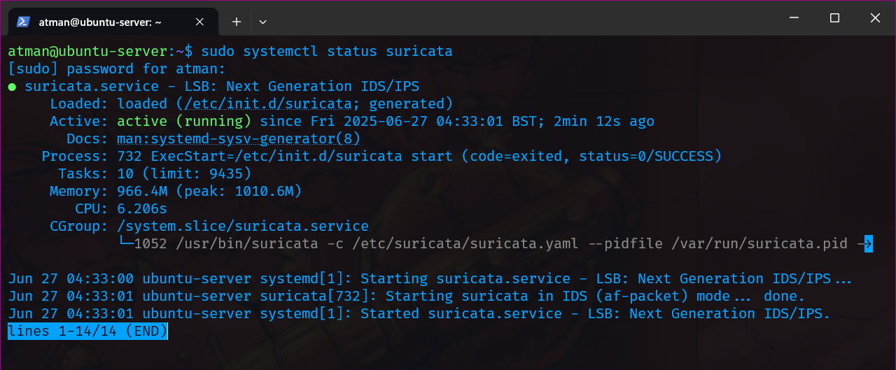

# Suricata IDS/IPS Installation and Configuration Guide

## Installation

### Prerequisites
- Ubuntu 20.04/22.04 LTS
- Root/sudo privileges
- Minimum 2GB RAM (4GB recommended)

### Installation Steps

```bash
# Add OISF repository
sudo add-apt-repository ppa:oisf/suricata-stable -y

# Update package lists
sudo apt update

# Install Suricata
sudo apt install suricata -y

# Enable on boot (optional)
sudo systemctl enable suricata.service

# Verify installation
sudo systemctl status suricata
```

 

## Configuration

### Network Configuration
First identify your network interface:
```bash
ip a
```

Edit the main configuration file:
```bash
sudo nano /etc/suricata/suricata.yaml
```

Key configurations:

1. **HOME_NET** (your protected network):
```yaml
HOME_NET: "[192.168.0.0/24]"  # Replace with your network
EXTERNAL_NET: "!$HOME_NET"
```

2. **Network Interface**:
```yaml
af-packet:
  - interface: enp0s3  # Replace with your interface
    cluster-id: 99
```

3. **Community Flow ID** (enable for better logging):
```yaml
community-id: true
```

4. **Rule Files**:
```yaml
rule-files:
  - suricata.rules
  - /etc/suricata/rules/local.rules  # For custom rules
```

 

## Rule Management

Update base rules:
```bash
sudo suricata-update
```

List available rule sources:
```bash
sudo suricata-update list-sources
```

Enable additional rules (e.g., ET Open rules):
```bash
sudo suricata-update enable-source et/open
sudo suricata-update
```

 

## Testing and Operation

### Validate Configuration
```bash
sudo suricata -T -c /etc/suricata/suricata.yaml -v
```

 


### Start Service
```bash
sudo systemctl start suricata.service
```

### Test Detection
```bash
curl http://testmynids.org/uid/index.html
```

### View Logs

Fast log format:
```bash
sudo tail -f /var/log/suricata/fast.log
```

JSON format (requires jq):
```bash
sudo apt install jq
sudo tail -f /var/log/suricata/eve.json | jq 'select(.event_type == "alert")'
```

 


 


## Custom Rules

Create custom rule file:
```bash
sudo nano /etc/suricata/rules/local.rules
```

Example rules:
```
# Detect Nmap scans
alert tcp $EXTERNAL_NET any -> $HOME_NET any (msg:"NMAP scan detected"; flow:to_server,established; content:"Nmap"; nocase; reference:url,nmap.org; classtype:network-scan; sid:1000001; rev:1;)

# Detect ICMP ping
alert icmp any any -> $HOME_NET any (msg:"ET POLICY ICMP Ping Detected"; itype:8; icode:0; sid:1000004; rev:1; classtype:misc-activity; reference:url,et.openam.com; priority:3;)

```
 


Reload rules:
```bash
sudo systemctl restart suricata.service
```

## Troubleshooting

### Common Issues

1. **Interface not found**:
   - Verify interface name with `ip a`
   - Ensure interface is up

2. **Rule syntax errors**:
   ```bash
   sudo suricata -T -c /etc/suricata/suricata.yaml -v
   ```

3. **No alerts appearing**:
   - Check if service is running: `sudo systemctl status suricata`
   - Verify network traffic is reaching the interface

### Log Locations
- Alerts: `/var/log/suricata/fast.log`
- Detailed events: `/var/log/suricata/eve.json`
- Stats: `/var/log/suricata/stats.log`


