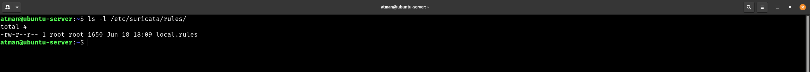
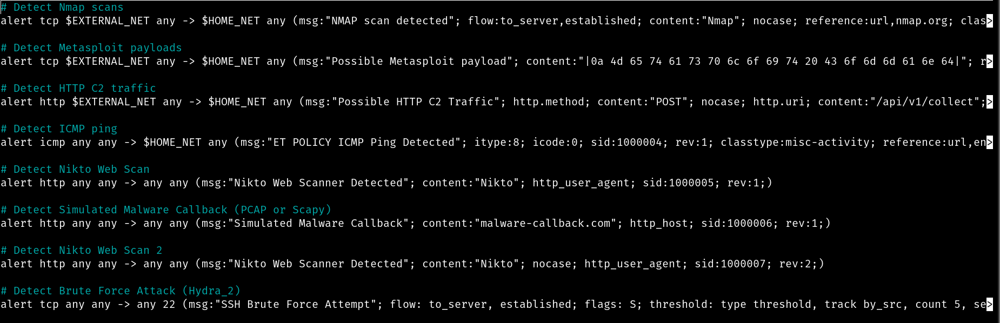
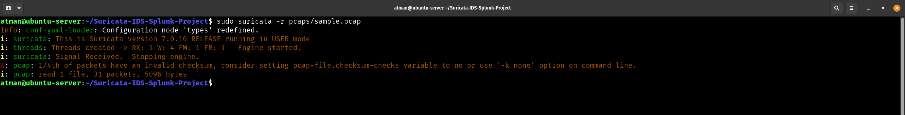
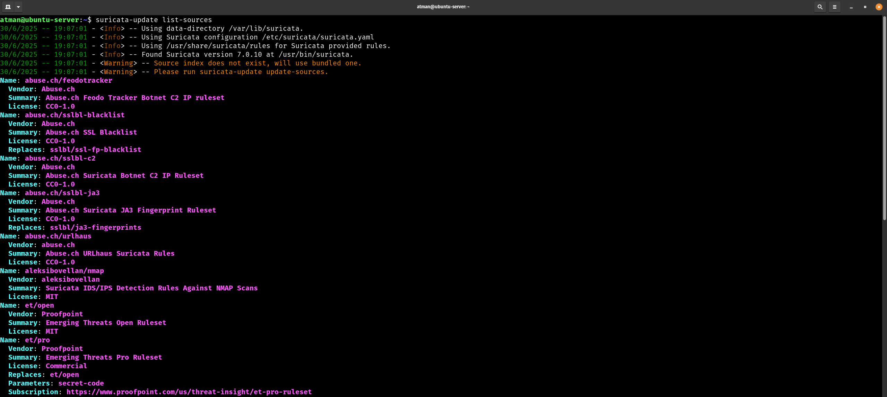
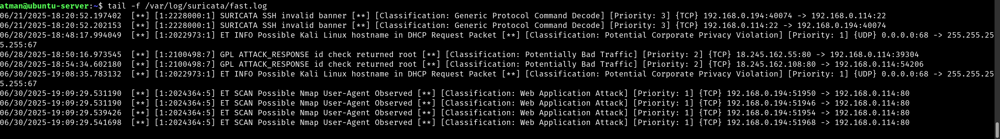
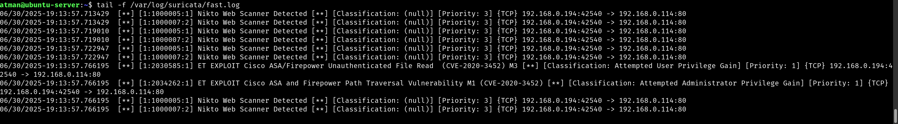
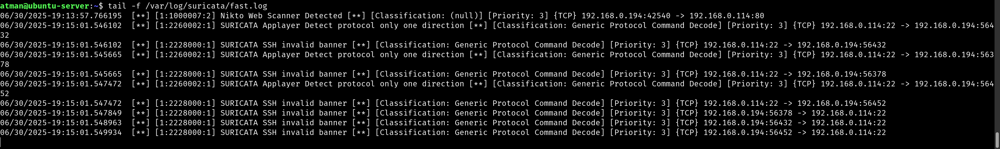
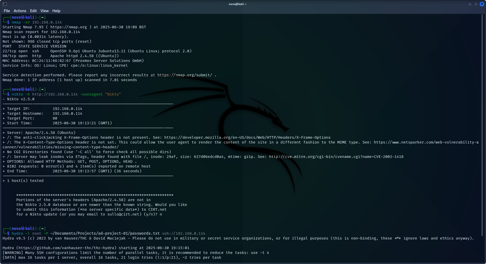

# Custom Rules, Threat Intel & Traffic Simulation

This document covers enhancing Suricata with custom rules, threat intelligence feeds, and attack simulation in your lab environment.

---

## ✅ Objectives

* Write custom rules directly in Suricata's default rules files
* Simulate attacks and verify detection in `eve.json`
* Integrate Emerging Threats rules
* Document evidence with lab screenshots

---

## 📁 Step 1: Locate Default Suricata Rules

Suricata's default rules are typically in:
```bash
/etc/suricata/rules/
```

Key files:
- `suricata.rules` (Main rule file)
- `local.rules` (For custom rules - we'll use this)

 

---

## 🛡️ Step 2: Add Custom Rules to `local.rules`

Edit the local rules file:
```bash
sudo nano /etc/suricata/rules/local.rules
```

Add these rules (adjust IPs for your lab):

### 🔍 1. **Nmap Scan Detection**
```suricata
alert tcp any any -> $HOME_NET any (msg:"NMAP TCP Scan Detected"; flags:S; threshold:type threshold, track by_src, count 5, seconds 3; sid:1000001; rev:1;)
```

### 🌐 2. **Nikto Web Scan**
```suricata
alert http any any -> $HOME_NET any (msg:"Nikto Web Scanner Detected"; content:"Nikto"; http_user_agent; sid:1000002; rev:1;)
```

### 🔑 3. **SSH Brute Force**
```suricata
alert tcp any any -> $HOME_NET 22 (msg:"SSH Brute Force Attempt"; threshold:type threshold, track by_src, count 5, seconds 10; sid:1000003; rev:1;)
```

### 🐛 4. **Simulated Malware Callback (PCAP or Scapy)**

```suricata
alert http any any -> any any (msg:"Simulated Malware Callback"; content:"malware-callback.com"; http_host; sid:1000004; rev:1;)
```
Kali Linux command: curl -H "Host: malware-callback.com" http://192.168.0.114

 


---

## 🔄 Step 3: Validate & Reload Suricata

Test configuration:
```bash
sudo suricata -T -c /etc/suricata/suricata.yaml -v
```

Reload Suricata):
```bash
sudo systemctl restart suricata
```

Or for PCAP analysis:
```bash
sudo suricata -r pcaps/sample.pcap
```

 

---

## 🌐 Step 4: Enable Emerging Threats Rules

Update rules (may take 2-5 minutes):
```bash
sudo suricata-update
```

Enable key rule sources:
```bash
sudo suricata-update enable-source et/open
sudo suricata-update enable-source oisf/trafficid
```

 


---

## 🧪 Step 5: Simulate Attacks & Verify Detection

### 🔍 **Nmap Scan (From Attacker Kali Linux)**
```bash
nmap -sV <Suricata_IP>
```
Corresponding alert in `tail -f /var/log/suricata/fast.log`  

 


### 🌐 **Nikto Scan**
```bash
nikto -h http://<Suricata_IP> -useragent "Nikto"
```

 


### 🔐 **SSH Brute Force (with Hydra)**

```bash
hydra -l root -P /usr/share/wordlists/rockyou.txt ssh://<target_IP>
```

 

 

> ⚠️ Run only in a **safe lab environment**.


