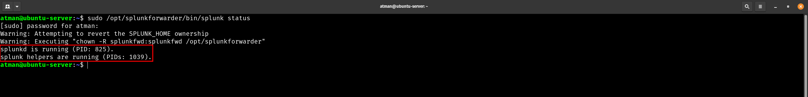
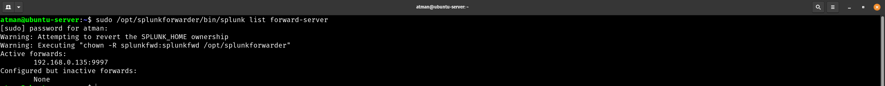
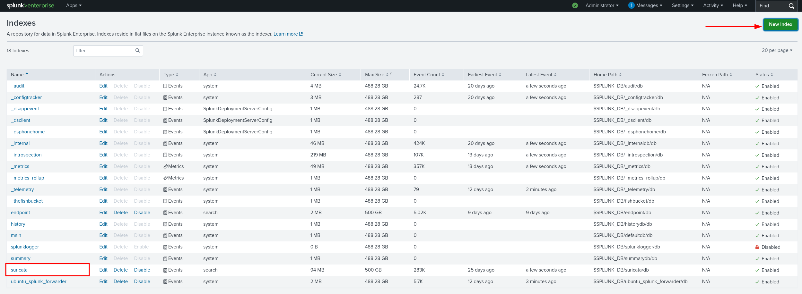
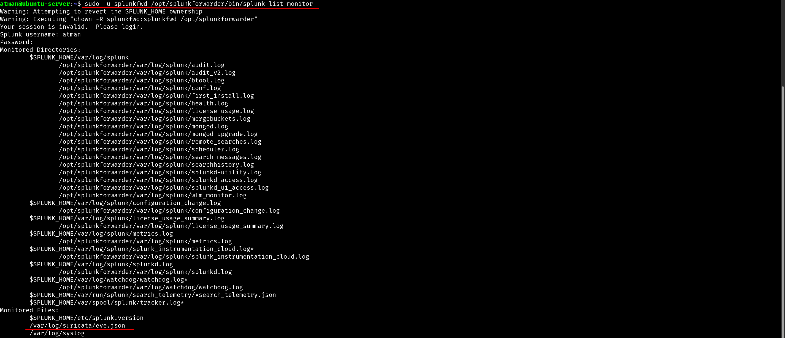
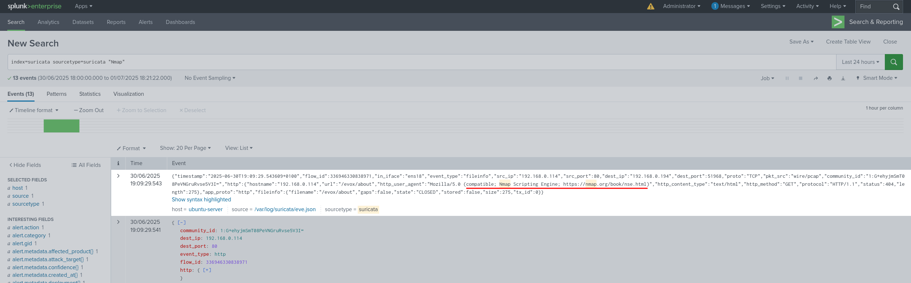

# Splunk Forwarder Setup & Suricata Log Ingestion

This guide covers setting up **Splunk Universal Forwarder** to collect Suricata logs and forward them to a Splunk Enterprise instance, including troubleshooting common issues.

> **🔍 Lab Setup Notes**:  
> - Splunk Enterprise IP: `192.168.0.135` (Receiver)  
> - Suricata Host IP: `192.168.0.X` (Forwarder)  
> - Default Splunk Port: `9997`

---

## ✅ Objectives

* Install Splunk Universal Forwarder on Suricata host
* Configure forwarding to Splunk Enterprise instance
* Create dedicated `suricata` index
* Validate log ingestion with JSON parsing

---

## 📥 Step 1: Install Splunk Forwarder

```bash
wget -O splunkforwarder.deb 'https://download.splunk.com/products/universalforwarder/releases/9.2.1/linux/splunkforwarder-9.2.1-dd0128b1f8cd-linux-2.6-amd64.deb'
sudo dpkg -i splunkforwarder.deb
sudo /opt/splunkforwarder/bin/splunk start --accept-license
sudo /opt/splunkforwarder/bin/splunk enable boot-start -user root
```

 

---

## 🔄 Step 2: Configure Forwarding

### A. Set Forwarding Destination
```bash
sudo /opt/splunkforwarder/bin/splunk add forward-server 192.168.0.135:9997
```

### B. Verify Connection
```bash
sudo /opt/splunkforwarder/bin/splunk list forward-server
```
> ✅ **Expected Output**:  
> `Active forwards: 192.168.0.135:9997`

 

> ⚠️ **Troubleshooting**:  
> If shows *"None"*, check firewall rules and receiver's `inputs.conf`:
> ```bash
> sudo nano /opt/splunk/etc/system/local/inputs.conf
> ```
> Ensure contains:
> ```ini
> [splunktcp://9997]
> disabled = 0
> ```
---

## 🛠️ Step 3: Receiver Configuration (Splunk Enterprise)

### Create `suricata` Index
1. Go to **Settings > Indexes > New Index**
2. Name: `suricata`
3. Set paths (or use defaults)

 

---

## 📂 Step 4: Monitor Suricata Logs

```bash
sudo -u splunkfwd /opt/splunkforwarder/bin/splunk add monitor /var/log/suricata/eve.json -index suricata -sourcetype suricata
```

Verify monitoring:
```bash
sudo -u splunkfwd /opt/splunkforwarder/bin/splunk list monitor
```

 

---

## 🧪 Step 5: Validate Data Flow

1. **On Forwarder**: Generate test alerts
   ```bash
   nmap -sV <Suricata_IP>
   ```

2. **On Splunk Enterprise**: Run search:
   ```spl
   index=suricata sourcetype=suricata "Nmap"
   ```

 


---

## ⚠️ Troubleshooting Cheatsheet

| Issue | Solution |
|-------|----------|
| `Active forwards: None` | 1. Check `inputs.conf` on receiver<br>2. Verify network connectivity |
| Data not appearing in index | 1. Confirm index name matches<br>2. Check forwarder's `monitor` command |
| JSON fields not extracted | 1. Validate `props.conf`<br>2. Restart Splunk |

---

## 💡 Pro Tips

1. **User Permissions**:  
   Always run `splunk` commands with correct user (e.g., `sudo -u splunkfwd`)

2. **Log Rotation**:  
   Add this to prevent log starvation:
   ```bash
   sudo /opt/splunkforwarder/bin/splunk add monitor /var/log/suricata/eve.json -index suricata -sourcetype suricata -follow-tail 1
   ```

3. **Performance**:  
   For high-volume environments, consider:
   ```ini
   [suricata]
   TRUNCATE = 100000
   MAX_DAYS_AGO = 2
   ```

