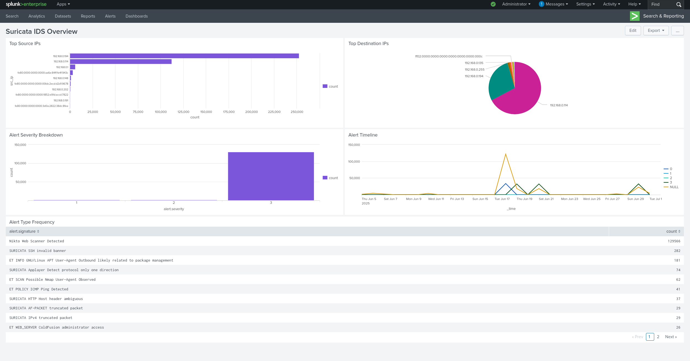

# Splunk Dashboards & Alerting for Suricata

This guide covers building actionable dashboards and alerts for Suricata IDS logs in Splunk.

---

## ✅ Objectives

* Create a **Suricata IDS Overview** dashboard
* Develop key visualizations using SPL queries
* Configure alerts for high-severity events
* Document reproducible SPL queries

---

## 🖥️ Step 1: Dashboard Setup

### Create New Dashboard
1. Navigate to **Dashboards** > **Create New Dashboard**
2. Name: `Suricata IDS Overview`
3. Type: **Classic Dashboard** (for simplicity)

---

## 📊 Core Dashboard Panels

### 1. High-Severity Alerts (Priority)
```spl
index=suricata sourcetype=suricata alert.severity>=3
| stats count by alert.signature, src_ip, dest_ip
| sort -count
```
**Visualization**: Table  
**Purpose**: Immediate visibility into critical threats

---

### 2. Alert Severity Distribution
```spl
index=suricata sourcetype=suricata
| stats count by alert.severity
```
**Visualization**: Pie Chart  
**Purpose**: Total number of Suricata alerts grouped by severity level

---

### 3. Top Attack Signatures
```spl
index=suricata sourcetype=suricata
| stats count by alert.signature
| sort -count
| head 10
```
**Visualization**: Bar Chart  
**Purpose**: Identify recurring attack patterns

---

### 4. Traffic Timeline
```spl
index=suricata sourcetype=suricata
| timechart count span=1h
```
**Visualization**: Line Chart  
**Purpose**: Hourly count of Suricata events


 