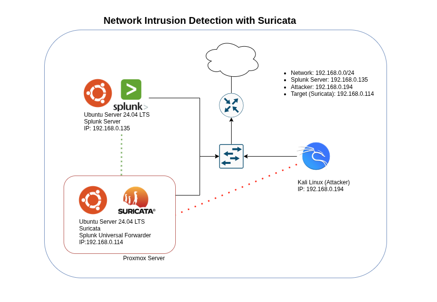

# 🛡️ Suricata IDS + Splunk Integration Lab

A hands-on lab to detect, visualize, and alert on network-based threats using **Suricata IDS** and **Splunk**. This guide walks through everything from deploying Suricata and simulating attacks to forwarding logs into Splunk and creating dashboards for threat visibility.

---

## 🎯 Lab Goals

* Deploy Suricata IDS on an Ubuntu server
* Write custom detection rules and simulate common attacks
* Forward Suricata logs to a Splunk Enterprise instance
* Build dashboards and alerts to monitor threats in real time
* Analyze PCAP files manually using Suricata

---

## 🧪 Lab Environment

| Role             | OS            | Tooling                       |
| ---------------- | ------------- | ----------------------------- |
| Suricata Host    | Ubuntu        | Suricata, Splunk Forwarder    |
| Attacker Machine | Kali Linux    | Nmap, Nikto, Hydra, curl, etc |
| Log Collector    | Splunk Server | Splunk Enterprise (receiver)  |

---

## 📁 Lab Structure

Each part of this lab is a standalone markdown file in this repository. Follow them in order:

### 🔹 [Part-1](./Part-1%20Suricata%20Installation%20&%20Configuration.md) – Suricata Installation & Configuration

* Install Suricata
* Set home networks and logging
* Enable community rules

### 🔹 [Part-1.1](./Part-1.1%20Generating%20&%20Transferring%20PCAPs.md) – Generating & Transferring PCAPs

* Capture test traffic in Wireshark (Kali)
* Transfer PCAP to Suricata (Ubuntu)
* Analyze with Suricata offline

### 🔹 [Part-2](./Part-2%20Custom%20Rules%20&%20Threat%20Simulations.md) – Custom Rules & Threat Simulations

* Write custom detection rules (e.g., Nmap, SSH brute force)
* Simulate attacks from Kali
* Inspect alert logs

### 🔹 [Part-3](./Part-3%20Splunk%20Forwarder%20Setup%20&%20Log%20Ingestion.md) – Splunk Forwarder Setup & Log Ingestion

* Install & configure Splunk Universal Forwarder
* Forward Suricata logs to Splunk
* Verify data ingestion

### 🔹 [Part-4](./Part-4%20Dashboards%20&%20Alerting%20in%20Splunk.md) – Dashboards & Alerting in Splunk

* Build a Suricata IDS overview dashboard
* Create SPL-based visualizations
* Set up alerts for high-severity events

---

## 🔄 Workflow Overview

This diagram shows the data flow between Suricata, the attacker machine, and Splunk, including how logs and PCAPs are handled across the lab environment.

---

## 🖼️ Sample Outputs

* 📊 Custom Splunk dashboard with alert heatmaps
* 🛑 Detection of simulated attacks via custom rules
* 📂 Structured JSON alerts from Suricata (`eve.json`)

> All screenshots are included in the `ScreenShots/` folder and referenced in each part for visual guidance.

---

## 🚀 Getting Started

1. Clone this repo to your VM or workstation
2. Start with [Part-1](./Part-1%20Suricata%20Installation%20&%20Configuration.md) and follow each section in order
3. Use the PCAP lab (`pcap-transfer.md`) for replaying traffic without active scanning

---

## 📌 Notes

* All tests are run in an isolated lab. Avoid scanning external hosts.
* Modify IPs and interfaces in configs to match your environment.
* Tested with Suricata 7.x and Splunk Universal Forwarder 9.x.

---

## 📬 Feedback / Contributions

Found a bug or want to contribute improvements?
Feel free to open an issue or submit a pull request.

---

Would you like me to generate this as a `README.md` file ready to use — or push this into a file structure for GitHub usage?
